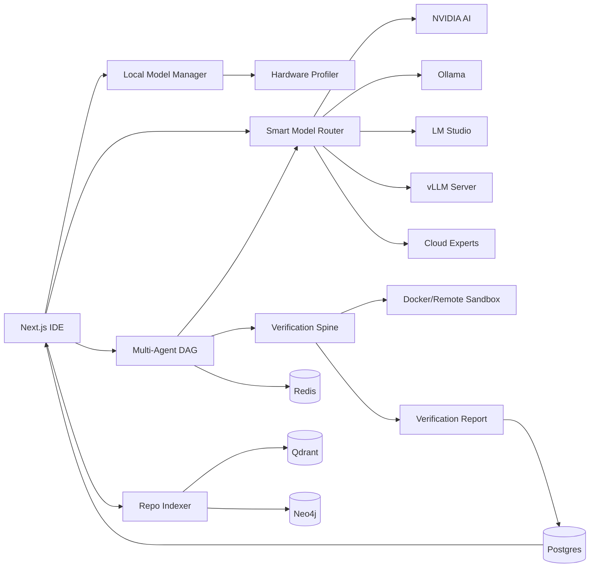

# Forge AI-Native IDE Upgrade

Goal: make Forge a faster, more accurate, more reliable AI-native coding
platform than Cursor-style single-agent IDEs by combining local coder models,
cloud fallback, repo indexing, multi-agent verification, and sandboxed execution.

## Updated Product Architecture

Forge becomes a local-first, cloud-optional coding platform:

- Local model manager: detects RAM, GPU VRAM, Ollama, LM Studio, and vLLM-ready models.
- NVIDIA AI provider: validates a user key, discovers account-visible NVIDIA
  hosted models, and exposes Settings and Models management in the IDE.
- Smart router: maps task complexity, privacy, budget, latency, file count, and context size to the best local/NVIDIA/cloud model chain.
- Repo intelligence: ripgrep, AST chunks, vector search, graph search, and memory.
- Multi-agent workflow: planner, coder, tester, debugger, security, reviewer, documentation, deployment.
- Verification spine: generated tests, static checks, sandbox execution, security scans, hallucination checks, rollback.
- Safety layer: memory fit checks, VRAM checks, fallback chains, no-crash model loading, explicit risky-action approval.
- Enterprise layer: policy, audit logs, managed model registry, benchmark dashboards, SSO/RBAC, isolated runners.

## Updated Mermaid Diagram



## Updated Folder Structure

```text
apps/web
  components/dashboard/LocalModelManager.tsx
  components/dashboard/ModelPicker.tsx
  components/dashboard/AgentDashboard.tsx
services/gateway/app
  routers/local_models.py
  routers/models.py
  routers/nvidia.py
services/orchestrator/orchestrator
  models/local_catalog.py
  models/hardware.py
  models/provider_interface.py
  models/nvidia.py
  models/router.py
  models/providers.py
  intelligence/
  execution/
  agents/
db/schema.sql
docs/AI_NATIVE_IDE_UPGRADE.md
```

## Updated Database Schema

Added tables:

- `hardware_profiles`: detected RAM, GPU, OS, compatibility tier.
- `local_model_catalog`: model facts, requirements, quantization, runtime support.
- `local_model_installs`: installed Ollama/LM Studio/vLLM models and status.
- `model_benchmarks`: tokens/sec, first-token latency, memory usage.
- `model_router_decisions`: model chain, mode, privacy, selected model, reason.
- `model_safety_events`: RAM/VRAM warnings, load failures, fallbacks.
- `ai_provider_settings`: NVIDIA/provider enablement, defaults, priorities,
  upload approval, excluded folders, and credential references.
- `ai_model_catalog`: discovered provider model metadata and capabilities.
- `ai_provider_request_history`: provider token usage and diagnostics.
- `provider_model_benchmarks`: cloud model latency and throughput results.

## PC RAM/VRAM Requirement Table

| Tier | Machine | RAM | GPU VRAM | Recommended models |
|---|---:|---:|---:|---|
| 1 | Low-end laptop | 8 GB | none | Qwen2.5-Coder 0.5B/1.5B, Llama 3.2 1B/3B Q4 |
| 2 | Standard laptop | 16 GB | 4 GB | Qwen2.5-Coder 3B/7B, CodeLlama 7B, DeepSeek-Coder 6.7B Q4 |
| 3 | Good developer laptop | 32 GB | 6-8 GB | Qwen2.5-Coder 7B/14B, DeepSeek-R1 Distill 14B Q4/Q5 |
| 4 | Workstation | 64 GB | 12-24 GB | Qwen2.5-Coder 14B/32B, Codestral 22B, DeepSeek-Coder 33B |
| 5 | High-end workstation/server | 128 GB+ | 48 GB+ | 32B, 70B, Mixtral, Llama 4 Scout/Maverick server routes |
| 6 | Cloud-only | managed | multi-GPU | Llama 3.1 405B and very large MoE models |

## Model Compatibility Table

RAM/VRAM values are conservative Q4/Q5 planning estimates. Actual memory varies by context length, KV cache, runtime, and quantization.

| Model | Params | Best use | RAM min/rec | VRAM min/rec | CPU | Code | Debug | Repo | Quant | Ollama command | LM Studio | vLLM | Product role |
|---|---:|---|---:|---:|---|---|---|---|---|---|---|---|---|
| Qwen2.5-Coder 0.5B | 0.5B | tiny autocomplete | 4/8 | 0/2 | Yes | Medium | Low | Low | Q4 | `ollama run qwen2.5-coder:0.5b` | Yes | Yes | autocomplete |
| Qwen2.5-Coder 1.5B | 1.5B | low-end edits | 8/12 | 0/2 | Yes | Medium | Medium | Low | Q4/Q5 | `ollama run qwen2.5-coder:1.5b` | Yes | Yes | autocomplete |
| Qwen2.5-Coder 3B | 3B | small functions | 8/16 | 2/4 | Yes | High | Medium | Medium | Q4/Q5 | `ollama run qwen2.5-coder:3b` | Yes | Yes | small coder |
| Qwen2.5-Coder 7B | 7B | default local coder | 16/32 | 4/8 | Yes | High | High | Medium | Q4/Q5 | `ollama run qwen2.5-coder:7b` | Yes | Yes | coder |
| Qwen2.5-Coder 14B | 14B | debugging/refactor | 32/64 | 8/16 | Yes | High | High | High | Q4/Q5 | `ollama run qwen2.5-coder:14b` | Yes | Yes | debugger |
| Qwen2.5-Coder 32B | 32B | repo-level coding | 64/128 | 20/40 | Yes | High | High | High | Q4/Q5/Q8 | `ollama run qwen2.5-coder:32b` | Yes | Yes | local expert |
| Llama 3.2 1B | 1B | tiny assistant | 4/8 | 0/2 | Yes | Low | Low | Low | Q4 | `ollama run llama3.2:1b` | Yes | Yes | offline helper |
| Llama 3.2 3B | 3B | rename/explain | 8/16 | 2/4 | Yes | Medium | Medium | Low | Q4/Q5 | `ollama run llama3.2:3b` | Yes | Yes | small assistant |
| Llama 3.1 8B | 8B | general assistant | 16/32 | 5/8 | Yes | Medium | Medium | Medium | Q4/Q5 | `ollama run llama3.1:8b` | Yes | Yes | assistant |
| Llama 3.1 70B | 70B | large reasoning | 128/192 | 48/80 | No | High | High | High | Q4/FP16 | `ollama run llama3.1:70b` | Yes | Yes | repo reasoner |
| Llama 3.1 405B | 405B | frontier open-weight cloud | 512/1024 | 240/400 | No | High | High | High | FP8/FP16 | N/A | No desktop | Yes | cloud expert |
| Llama 3.2 Vision 11B | 11B | UI/screenshot reasoning | 32/64 | 8/16 | Yes | Medium | Medium | Medium | Q4/Q5 | `ollama run llama3.2-vision:11b` | Yes | Partial | visual reviewer |
| Llama 3.2 Vision 90B | 90B | large visual review | 160/256 | 64/100 | No | Medium | High | High | Q4/FP16 | `ollama run llama3.2-vision:90b` | Limited | Yes | visual expert |
| Llama 3.3 70B | 70B | code review/reasoning | 128/192 | 48/80 | No | High | High | High | Q4/FP16 | `ollama run llama3.3:70b` | Yes | Yes | reviewer |
| Llama 4 Scout | 17B active / 109B total | long context multimodal | 128/192 | 48/80 | No | High | High | High | FP8/FP16 | N/A | Limited | Yes | long-context expert |
| Llama 4 Maverick | 17B active / 400B total | server expert | 256/512 | 96/160 | No | High | High | High | FP8/FP16 | N/A | No desktop | Yes | cloud/server expert |
| DeepSeek-Coder 1.3B | 1.3B | tiny completion | 8/12 | 0/2 | Yes | Medium | Low | Low | Q4/Q5 | `ollama run deepseek-coder` | Yes | Yes | autocomplete |
| DeepSeek-Coder 6.7B | 6.7B | write/debug function | 16/32 | 4/8 | Yes | High | High | Medium | Q4/Q5 | `ollama run deepseek-coder:6.7b` | Yes | Yes | coder/debugger |
| DeepSeek-Coder 33B | 33B | large repair | 64/128 | 20/40 | Yes | High | High | High | Q4/Q5 | `ollama run deepseek-coder:33b` | Yes | Yes | local expert |
| DeepSeek-R1 Distill 7B | 7B | reasoning triage | 16/32 | 4/8 | Yes | Medium | High | Medium | Q4/Q5 | `ollama run deepseek-r1:7b` | Yes | Yes | debugger |
| DeepSeek-R1 Distill 14B | 14B | reasoning review | 32/64 | 8/16 | Yes | Medium | High | High | Q4/Q5 | `ollama run deepseek-r1:14b` | Yes | Yes | reviewer |
| CodeLlama 7B | 7B | fallback code completion | 16/32 | 4/8 | Yes | Medium | Medium | Low | Q4/Q5 | `ollama run codellama:7b` | Yes | Yes | fallback coder |
| StarCoder2 7B | 7B | polyglot completion | 16/32 | 4/8 | Yes | High | Medium | Medium | Q4/Q5 | `ollama run starcoder2:7b` | Yes | Yes | completion specialist |
| Codestral 22B | 22B | strong code generation | 48/96 | 16/24 | Yes | High | High | High | Q4/Q5 | `ollama run codestral` | Yes | Yes | coder expert |
| Phi 3.5 Mini | 3.8B | fast assistant | 8/16 | 2/4 | Yes | Medium | Medium | Low | Q4/Q5 | `ollama run phi3.5` | Yes | Yes | cheap assistant |
| Gemma 3 4B | 4B | small assistant | 12/24 | 3/6 | Yes | Medium | Medium | Medium | Q4/Q5 | `ollama run gemma3:4b` | Yes | Yes | small assistant |
| Mistral 7B | 7B | general fallback | 16/32 | 4/8 | Yes | Medium | Medium | Medium | Q4/Q5 | `ollama run mistral` | Yes | Yes | fallback |
| Mixtral 8x7B | 8x7B MoE | planning/refactor | 64/128 | 24/48 | No | High | High | High | Q4/Q5 | `ollama run mixtral` | Yes | Yes | planning expert |
| Yi-Coder 9B | 9B | repair/codegen | 24/48 | 6/12 | Yes | High | Medium | Medium | Q4/Q5 | `ollama run yi-coder:9b` | Yes | Yes | coder |
| Granite Code 8B | 8B | enterprise code | 16/32 | 5/8 | Yes | High | Medium | Medium | Q4/Q5 | `ollama run granite-code:8b` | Yes | Yes | enterprise coder |
| MiniCPM 2.4B | 2.4B | tiny explain mode | 8/16 | 0/4 | Yes | Low | Medium | Low | Q4 | `ollama run minicpm-v` | Yes | Partial | small assistant |
| InternLM 2.5 7B | 7B | reasoning fallback | 16/32 | 4/8 | Yes | Medium | Medium | Medium | Q4/Q5 | `ollama run internlm2` | Yes | Yes | reasoning fallback |
| Nous Hermes 2 Mixtral | 8x7B MoE | instruction/planning | 64/128 | 24/48 | No | Medium | High | High | Q4/Q5 | `ollama run nous-hermes2-mixtral` | Yes | Yes | planner fallback |
| OpenChat 7B | 7B | chat fallback | 16/32 | 4/8 | Yes | Medium | Medium | Low | Q4/Q5 | `ollama run openchat` | Yes | Yes | assistant fallback |

## Ollama Install Commands

```bash
ollama pull qwen2.5-coder:0.5b
ollama pull qwen2.5-coder:1.5b
ollama pull qwen2.5-coder:3b
ollama pull qwen2.5-coder:7b
ollama pull qwen2.5-coder:14b
ollama pull qwen2.5-coder:32b
ollama pull llama3.2:1b
ollama pull llama3.2:3b
ollama pull llama3.1:8b
ollama pull deepseek-coder:6.7b
ollama pull deepseek-r1:14b
ollama pull codellama:7b
ollama pull starcoder2:7b
ollama pull codestral
ollama pull granite-code:8b
```

## Model Router Logic

```text
Input: task type, changed files, context tokens, privacy, budget, latency target,
       RAM, VRAM, installed models, configured cloud keys.

1. Classify task:
   small: autocomplete, rename, explain small function
   medium: write function, debug error, unit tests
   large: multi-file refactor, architecture planning, complex bug
   critical: production/security/deployment
2. Filter by privacy:
   offline/local -> only installed local models that fit RAM/VRAM
   hybrid -> local-first, cloud fallback
   nvidia_only -> validated NVIDIA account-visible models only
   cloud_fallback -> local, then NVIDIA, then secondary cloud provider
   cloud expert -> strongest configured expert model
3. Filter by safety:
   reject models above available RAM/VRAM
   warn and fallback when estimated memory exceeds 80 percent of available
4. Rank by mode:
   fast -> lowest tier and highest tokens/sec
   balanced -> best fit for task tier
   accurate -> largest fitting local model, then cloud fallback
   cheap -> local first, then lowest cloud price
   cloud_expert -> Claude/Gemini/Kimi/OpenRouter expert chain
5. Record router decision and benchmark data.
```

Default chains:

- Small: Qwen2.5-Coder 1.5B/3B, Llama 3.2 3B.
- Medium: Qwen2.5-Coder 7B, DeepSeek-Coder 6.7B, CodeLlama 7B.
- Large: Qwen2.5-Coder 14B/32B, Llama 3.1 70B, Claude expert fallback.
- Critical: cloud expert model plus local tests, reviewer, security, and human approval.

## FastAPI API Design

| Method | Path | Purpose |
|---|---|---|
| GET | `/api/models` | Existing unified cloud/local catalog |
| GET | `/api/local-models/catalog` | Full local compatibility table |
| GET | `/api/local-models/hardware` | Detect RAM, VRAM, Ollama, LM Studio |
| POST | `/api/local-models/recommend` | Recommend models for mode/task/privacy |
| GET | `/api/local-models/ollama/installed` | List installed Ollama models |
| POST | `/api/local-models/ollama/pull` | Stage safe install command |
| POST | `/api/local-models/ollama/delete` | Stage safe delete command |
| POST | `/api/local-models/benchmark` | Benchmark endpoint shell for tokens/sec |
| GET | `/api/nvidia/status` | NVIDIA key, connection, usage, diagnostics |
| POST | `/api/nvidia/api-key` | Validate and save NVIDIA key |
| DELETE | `/api/nvidia/api-key` | Remove locally stored NVIDIA key |
| GET | `/api/nvidia/models` | Cached NVIDIA model catalog |
| POST | `/api/nvidia/models/refresh` | Refresh live NVIDIA model discovery |
| POST | `/api/nvidia/models/favorite` | Favorite/unfavorite a NVIDIA model |
| POST | `/api/nvidia/models/default` | Pin default NVIDIA model |
| POST | `/api/nvidia/benchmark` | Benchmark a NVIDIA model |
| POST | `/api/nvidia/compare` | Compare NVIDIA model metadata |

## Frontend UI Design

- Runtime mode selector: Fast, Balanced, Accurate, Offline, Cheap, Cloud expert.
- NVIDIA panel: API key validation, connection status, refresh, search, filters,
  favorites, default model, benchmark, compare, request history, and diagnostics.
- Local model manager: hardware tier, RAM, VRAM, Ollama status, recommended models.
- Model card details: best use, RAM/VRAM min/recommended, quantization, command.
- Safe actions: show install/delete command first; do not silently download huge files.
- Benchmark button: records tokens/sec, memory, first-token latency.
- Warning states: too large, no GPU, missing runtime, fallback selected.

## Agent Workflow

1. Planner classifies complexity and retrieves repo context.
2. Router selects local/cloud chain using runtime mode and hardware profile.
3. Tester writes or detects test plan.
4. Coder creates a diff; local fallback creates valid starter patches.
5. Sandbox applies patch and runs tests/static checks.
6. Hallucination detector checks paths/imports/symbols.
7. Security agent scans secrets and risk.
8. Reviewer panel checks correctness, security, maintainability.
9. Deployment agent stages artifact and awaits approval when needed.
10. Report is persisted with cost, tokens, gates, files, and router decision.

## MVP Roadmap

1. Local model catalog and hardware detection.
2. Runtime mode selector and recommendation UI.
3. Ollama installed-model detection.
4. Safe install/delete command staging.
5. Benchmark recording.
6. Router decision logs.
7. Repo index quality improvements.
8. Better patch parser and diff repair loop.
9. Remote sandbox runner for Windows/macOS/Linux.
10. Golden benchmark suite for autocomplete, edits, debugging, refactor.

## Enterprise Roadmap

1. SSO/RBAC and project-level model policy.
2. Private model registry and approved quantization list.
3. Central benchmark dashboard by team/hardware/model.
4. Audit-ready router decisions and safety events.
5. Data residency controls and cloud model allow/deny lists.
6. Isolated runner pools with per-tenant sandboxes.
7. Fine-tuned local models and LoRA adapter registry.
8. SOC2-oriented logs, retention, and redaction.
9. Air-gapped mode with offline model bundles.
10. Multi-repo memory graph and organization coding standards.

## Benchmark Plan Against Cursor, Kimi Work, and Antigravity

Benchmark dimensions:

- Latency: autocomplete first token, edit generation, test generation.
- Accuracy: SWE-bench style bug fixes, repo-local unit tests, patch applies cleanly.
- Reliability: rollback success, no invalid diffs, no crashed model loads.
- Safety: destructive command prevention, sandbox containment, secret detection.
- Local capability: useful offline coding on Tier 1-5 PCs.
- Cost: local token share, cloud fallback spend, calls per accepted patch.
- Transparency: report quality, artifacts, test evidence, replayable logs.

Evaluation harness:

1. 50 small tasks: rename, explain, autocomplete, one-function implementation.
2. 50 medium tasks: unit tests, bug fixes, API additions.
3. 25 large tasks: multi-file refactors, architecture changes.
4. 10 critical tasks: auth, secrets, migrations, deployment.
5. Measure accepted patches, failed patches, human interventions, time-to-green.
6. Run each IDE/tool on same repositories, same prompts, same acceptance tests.

Sources used for model/runtime facts:

- Qwen2.5-Coder model card: https://huggingface.co/Qwen/Qwen2.5-Coder-32B-Instruct
- Qwen2.5-Coder technical report: https://arxiv.org/abs/2409.12186
- Ollama qwen2.5-coder: https://ollama.com/library/qwen2.5-coder
- Ollama DeepSeek Coder: https://ollama.com/library/deepseek-coder
- vLLM supported models: https://docs.vllm.ai/en/latest/models/supported_models/
- Meta Llama 4 announcement: https://ai.meta.com/blog/llama-4-multimodal-intelligence/
- LM Studio model docs: https://lmstudio.ai/docs/app/basics/download-model
