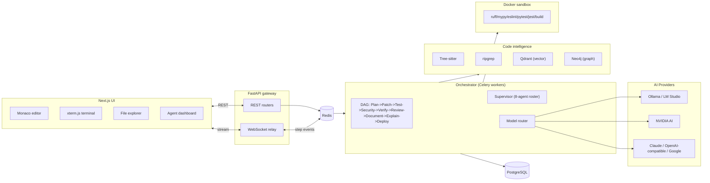
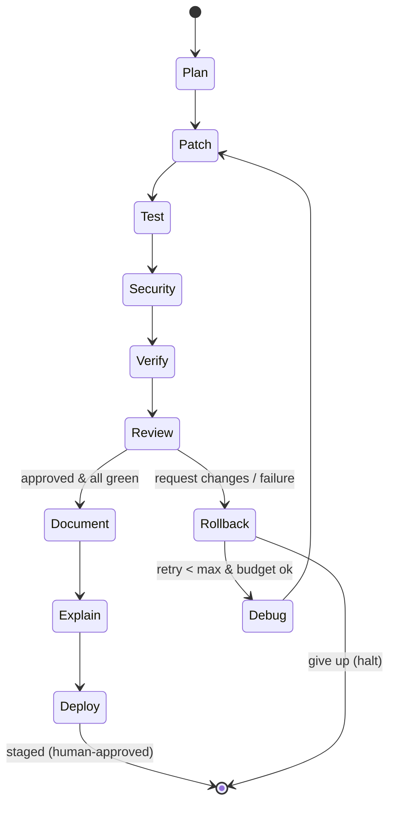

# Forge — Architecture

## System overview

## Reliability loop (per task)

## Multi-agent team
Eight specialized agents, coordinated by the **Supervisor** roster in `agents/supervisor.py`. Blocking agents can fail the pipeline; non-blocking agents enrich it.

| Agent | Phase | Model tier | Blocking | Responsibility |
|---|---|---|---|---|
| **Planner** | plan | Opus 4.8 | yes | Decompose goal into a typed task DAG with acceptance criteria |
| **Coder** | patch | Sonnet | yes | Implement tasks as grounded unified-diff patches |
| **Tester** | test | Gemini Flash | yes | Generate missing tests + run the suite in the sandbox |
| **Debugger** | debug | Opus 4.8 | no | Root-cause failures, enrich context for the next loop |
| **Security** | security | Opus 4.8 | yes | Secret scan, dependency audit, logic-vuln review |
| **Reviewer** | review | Opus 4.8 | yes | Independent semantic gate: APPROVE / REQUEST_CHANGES |
| **Documentation** | document | Qwen Coder (local) | no | Keep docstrings, README, changelog in sync |
| **Deployment** | deploy | Sonnet | no | Build artifact + stage a human-approved deploy (HITL) |

## Why this is accurate & low-hallucination
1. **Grounded retrieval** — hybrid lexical + semantic + structural search means the model edits real symbols, not imagined ones.
2. **AST-aware chunking** — chunks align to functions/classes, so context is coherent.
3. **Mechanical gate** — nothing is surfaced until ruff/mypy/eslint/tests/build pass in a sandbox.
4. **Independent reviewer** — a separate Opus 4.8 agent reviews intent vs. acceptance criteria; it never reviews its own code.
5. **Security gate** — secret/dependency/logic scans block any change with high-severity findings.
6. **Checkpoint + rollback** — every loop is reversible; failures never corrupt the workspace.
7. **Human-in-the-loop deploy** — deployment is staged and requires explicit approval; agents never auto-ship to prod.

## Model routing (model-agnostic, user-selectable)
Forge is **bring-your-own-model**. The user can pick any popular coding model in
the world per agent role; if they pick nothing, smart per-task defaults apply.
The single source of truth is `models/providers.py` (catalog) and `models/router.py`
(selection). Add a model = add one catalog entry; nothing else changes.

For the new local-first architecture, Forge also maintains a hardware-aware
local model catalog in `models/local_catalog.py`, hardware detection in
`models/hardware.py`, and a Local Model Manager in the web dashboard. See
`docs/AI_NATIVE_IDE_UPGRADE.md` for the complete compatibility table, RAM/VRAM
tiers, API design, UI design, roadmap, and benchmark plan.

The NVIDIA AI provider adds a discovery-first cloud path:

- `models/provider_interface.py` defines the provider contract.
- `models/nvidia.py` validates and stores the NVIDIA API key, discovers models
  through the OpenAI-compatible NVIDIA endpoint, enriches model metadata, and
  supports chat, streaming, embeddings, health checks, and benchmarks.
- `GET /api/nvidia/models` and `POST /api/nvidia/models/refresh` drive the
  dedicated NVIDIA Models panel.
- `GET /api/models` merges cached NVIDIA discoveries into the unified picker.
- New router modes include `nvidia_only`, `hybrid`, and `cloud_fallback`.

See `docs/NVIDIA_AI_PROVIDER.md` for the full NVIDIA architecture, sequence
diagrams, security model, schema updates, benchmark framework, and deployment
guide.

**Worldwide catalog (≈29 models across 19 providers):**

| Region | Providers / models |
|---|---|
| 🇺🇸 US | Anthropic (Opus 4.8, Sonnet 4.5, Haiku) · OpenAI (GPT-5, GPT-5 mini, GPT-4.1, o4-mini) · Google (Gemini 2.5 Pro/Flash) · xAI (Grok Code, Grok 4) · Cohere (Command A) · Meta Llama (via Groq/Together) · Perplexity (Sonar Pro / Sonar Reasoning) |
| 🇨🇳 China | Moonshot Kimi K2 · DeepSeek V3 / R1 · Alibaba Qwen2.5 Coder |
| 🇮🇳 India | Sarvam-M · Ola Krutrim-2 · TWO AI SUTRA-V2 |
| 🇪🇺 Europe | Mistral Large · Codestral |
| 🌐 Gateways | OpenRouter (one key → almost any model) · Groq · Together · Fireworks |
| 💻 Local | Ollama & LM Studio (Qwen Coder, DeepSeek, Llama) — zero key, zero cost |

**How selection works:** user pick → role/global override goes to the front of
the chain → hybrid/local filter (if *Local only*) → prefer providers with a
configured API key → speed-vs-accuracy reordering. Unconfigured providers are
skipped automatically. Four adapters cover everything: `anthropic`, `google`,
`ollama`, and one `openai`-compatible adapter (per-provider base URL + key) that
serves OpenAI, DeepSeek, Moonshot, Qwen, Mistral, xAI, Groq, Together, Fireworks,
Cohere, OpenRouter, and LM Studio.

**Smart per-task defaults (used when the user chooses nothing):**

| Task | Primary | Fallbacks |
|---|---|---|
| Plan / Debug | Claude Opus 4.8 | Gemini 2.5 Pro, Kimi K2 |
| Security / Review | Claude Opus 4.8 | Gemini 2.5 Pro / Sonnet |
| Code | Claude Sonnet | Gemini Flash, Kimi K2 |
| Test gen | Gemini Flash | Claude Sonnet |
| Deploy | Claude Sonnet | Gemini Flash |
| Long context / multi-agent | Kimi K2 | Gemini 2.5 Pro |
| Autocomplete / docs | local Qwen Coder | Gemini Flash |

The IDE model picker is fed by `GET /api/models`; choices ride along with each
run (`POST /api/runs` `models` field) and are applied by `router.set_overrides`.

## Data stores
- **PostgreSQL** — source of truth (runs, steps, diffs, verifications, audit).
- **Qdrant** — semantic code/doc vectors per project.
- **Neo4j** — code graph (files, symbols, calls, imports) for structural retrieval.
- **Redis** — Celery broker + pub/sub for live step streaming.
