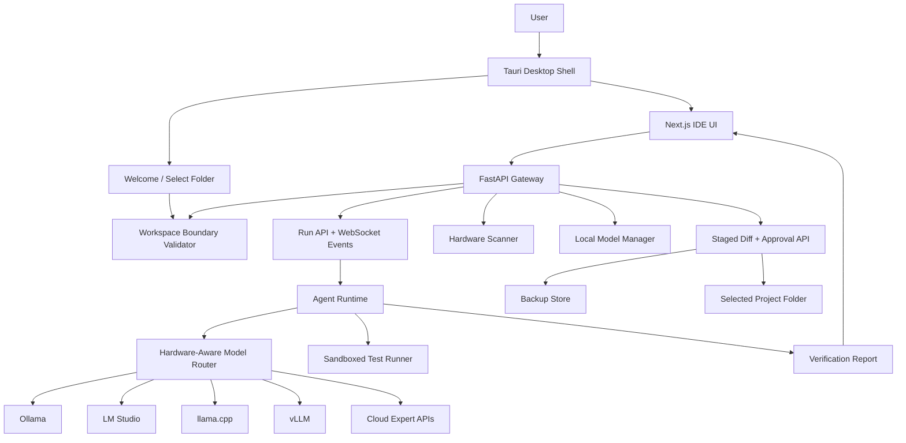

# Forge Desktop IDE Plan

## Product Vision

Forge is a downloadable AI-native coding IDE for Windows, macOS, and Linux. It combines a local desktop shell, Monaco code editor, FastAPI gateway, local agent runtime, repo indexing, local model support, cloud fallback, staged diffs, test verification, and strict workspace isolation.

The goal is not just to generate code. Forge should make every AI change inspectable, reversible, benchmarkable, and safe.

## Updated Architecture

- Desktop shell: Tauri, with Electron still possible if marketplace extensions become a priority.
- Frontend: Next.js, React, Monaco Editor, terminal, agent dashboard, model manager.
- Gateway: FastAPI API server for project selection, workspace validation, staged diffs, models, runs, metrics, and hardware.
- Agent runtime: Python/Celery orchestrator with planner, coder, tester, reviewer, debugger, security, documentation, and deployment agents.
- Model runtimes: Ollama, LM Studio, llama.cpp, vLLM, and cloud APIs.
- Execution: Docker sandbox when available, local isolated workspace fallback.
- Storage: Postgres schema for users, projects, runs, diffs, workspaces, local models, benchmarks, backups, and audit logs.

## Desktop App Architecture

```text
apps/desktop
  package.json
  src-tauri/
    Cargo.toml
    tauri.conf.json
    src/main.rs

apps/web
  Next.js IDE UI

services/gateway
  FastAPI local gateway

services/orchestrator
  Python agent runtime
```

Desktop startup flow:

1. Tauri starts local gateway and worker sidecars.
2. Tauri opens the Forge window.
3. User selects a project folder.
4. Folder path is registered through `/api/projects/select`.
5. Every read, diff, backup, and approved save goes through the workspace validator.

## Workspace Boundary Design

Rules:

- User must select a project folder before agent work.
- The selected folder is the only writable workspace root.
- Absolute and relative paths are normalized before use.
- `..` traversal is blocked.
- Writes to the selected folder itself are blocked.
- Writes outside the selected root are blocked.
- Broad roots like Desktop/Downloads/system folders generate warnings.
- Every approved write goes through `workspace_guard.validate_path`.

Implemented foundation:

- `services/gateway/app/workspace_guard.py`
- `POST /api/projects/select`
- `GET /api/projects`
- `GET /api/projects/{project_id}/tree`
- `GET /api/projects/{project_id}/file`

## Permission-Before-Save Workflow

Required workflow:

1. User request.
2. Agent plans task.
3. Agent reads selected workspace.
4. Agent generates patch.
5. IDE shows affected files, changed lines, diff, and risk level.
6. User chooses approve, reject, edit manually, selected-file save, and backup setting.
7. Only approved files are written.
8. Backup is created first when enabled.
9. Tests run after save.
10. Failures produce a new suggested patch and require approval again.

Implemented foundation:

- Agent report includes `patches`, `artifacts`, `risk_level`, and `requires_save_approval`.
- `POST /api/diffs/stage` stages a diff without saving.
- `POST /api/diffs/{diff_id}/decision` approves/rejects and writes only selected files.
- `AgentOutput` shows diff and permission controls.

## Hardware Detection Workflow

Detection targets:

- OS
- Total RAM
- Available RAM
- CPU model
- GPU name
- GPU VRAM
- Disk space
- Ollama installation and models
- LM Studio endpoint/models
- Python, Node, Docker, Git

Current implementation detects OS, RAM, GPU VRAM where available, Ollama, LM Studio configuration, and local catalog recommendations. Next step is to expand `hardware.py` with CPU, disk, Docker, Git, Python, and Node checks.

## Dynamic RAM/VRAM Selection Logic

Recommended policy:

- RAM under 8 GB: cloud mode or tiny local models only.
- RAM 8-16 GB: Qwen2.5-Coder 1.5B/3B quantized.
- RAM 16-32 GB and 4 GB VRAM: Qwen2.5-Coder 3B/7B Q4.
- RAM 32-64 GB and 8 GB VRAM: Qwen2.5-Coder 7B/14B Q4.
- RAM 64 GB+ and 16-24 GB VRAM: Qwen2.5-Coder 14B/32B Q4/Q5.
- 70B/405B/MoE models: cloud API or multi-GPU server.

Router inputs:

- Hardware tier
- RAM and VRAM availability
- Task complexity
- Number of files
- Context size
- Privacy mode
- Internet availability
- Cost preference
- Latency target

Modes:

- Offline
- Fast
- Balanced
- Accurate
- Cloud expert
- Low RAM
- GPU
- CPU-only

## Local Model Manager Design

Manager capabilities:

- Detect Ollama installation.
- Detect LM Studio endpoint.
- Detect llama.cpp model folders.
- List installed models.
- Show model size and RAM/VRAM estimates.
- Show run compatibility for this machine.
- Recommend best model.
- Stage download command.
- Delete unused models with confirmation.
- Benchmark tokens/second.
- Show memory usage.
- Fallback to smaller model on load failure.

Current UI:

- `LocalModelManager.tsx`
- `/api/local-models/catalog`
- `/api/local-models/hardware`
- `/api/local-models/recommend`
- `/api/local-models/ollama/installed`
- `/api/local-models/benchmark`

## Model Compatibility Table

The full table lives in `docs/AI_NATIVE_IDE_UPGRADE.md` and the runtime catalog lives in:

- `services/orchestrator/orchestrator/models/local_catalog.py`

Supported families:

- Qwen2.5-Coder: 0.5B, 1.5B, 3B, 7B, 14B, 32B
- Llama: 3.1 8B/70B/405B, 3.2 1B/3B, 3.3 70B, 4 Scout, 4 Maverick
- DeepSeek-Coder, DeepSeek-R1 Distill, CodeLlama, StarCoder2, Codestral, Phi, Gemma, Mistral, Mixtral, Yi-Coder, Granite Code, MiniCPM, InternLM, Nous Hermes, OpenChat

Each catalog entry includes parameter size, best use case, RAM/VRAM estimates, CPU/GPU support, quantization, Ollama command, LM Studio support, vLLM support, and product role.

## Agent Workflow

```text
Select project folder
  -> scan hardware
  -> choose model mode
  -> user request
  -> plan
  -> retrieve selected-folder context
  -> generate patch
  -> hallucination/security/static review
  -> show diff and risk
  -> user approval
  -> backup
  -> write approved files only
  -> run tests
  -> show results
  -> rollback or iterate with permission
```

## Mermaid Architecture Diagram



## Folder Structure

```text
apps/
  desktop/                  # Tauri shell and installers
  web/                      # Next.js IDE
services/
  gateway/                  # FastAPI local gateway
  orchestrator/             # Python agent runtime
db/
  schema.sql                # app schema
docs/
  DESKTOP_IDE_PLAN.md
  AI_NATIVE_IDE_UPGRADE.md
```

## Backend API Design

- `POST /api/projects/select`: register selected folder.
- `GET /api/projects`: recent projects.
- `GET /api/projects/{project_id}`: active project info.
- `GET /api/projects/{project_id}/tree`: safe workspace tree.
- `GET /api/projects/{project_id}/file?path=...`: safe file read.
- `POST /api/runs`: start agent run.
- `GET /api/runs/{run_id}/report`: verification and staged patch report.
- `POST /api/diffs/stage`: stage generated patch.
- `GET /api/diffs/{diff_id}`: inspect staged diff.
- `POST /api/diffs/{diff_id}/decision`: approve/reject selected files.
- `GET /api/local-models/hardware`: hardware scan.
- `GET /api/local-models/catalog`: model catalog.
- `POST /api/local-models/recommend`: hardware-aware recommendations.

## Frontend Screen Design

- Welcome screen with select project folder and recent projects.
- Main IDE with explorer, Monaco editor, terminal, and right-side agent panel.
- Hardware scan and recommended model panel.
- Runtime mode selector.
- Local model manager.
- Agent mission-control event stream.
- Output panel with generated code.
- Diff view with risk and affected files.
- Permission controls before save.
- Verification report.
- Cost dashboard.
- Settings and privacy toggles in V1.

## Database Schema

New safety tables:

- `selected_workspaces`
- `staged_diffs`
- `staged_diff_files`
- `file_backups`
- `agent_action_log`

Existing AI-native tables:

- `hardware_profiles`
- `local_model_catalog`
- `local_model_installs`
- `model_benchmarks`
- `model_router_decisions`
- `model_safety_events`

## Security Rules

- Never write outside selected folder.
- Never save generated code without approval.
- Never delete without explicit deletion approval.
- Always show diff before save.
- Always validate paths before reads and writes.
- Always create backups for risky edits.
- Always log agent actions.
- Always block path traversal.
- Always fallback when a model is too large.
- Always separate generated patch creation from approved disk writes.

## MVP Roadmap

1. Desktop shell launches web/gateway/worker locally.
2. Project folder selection and recent projects.
3. Safe file explorer and editor.
4. Agent run dashboard.
5. Staged diff approval.
6. Local hardware scan.
7. Ollama/LM Studio model detection.
8. Basic local/cloud routing.
9. Test runner after approved save.
10. Installer builds for Windows, macOS, Linux.

## V1 Roadmap

1. Real Tauri sidecar process manager.
2. Native folder picker everywhere.
3. Indexed repo graph with tree-sitter.
4. llama.cpp model folder detection.
5. Real benchmark harness.
6. Manual patch editing before approval.
7. Rollback UI.
8. Settings page.
9. Privacy mode by workspace.
10. Offline-first model execution.

## Enterprise Roadmap

1. SSO and organization policy.
2. Admin-approved model catalog.
3. Central audit log.
4. Policy-controlled cloud fallback.
5. Team benchmarks.
6. Private model gateway.
7. Remote sandbox workers.
8. Compliance export.
9. Role-based approval rules.
10. Air-gapped deployment bundle.

## Benchmark Plan

Compare Forge against Cursor, Kimi Work, and Antigravity on:

- Time to first useful patch.
- Compile/test pass rate.
- Repo-level bug fix accuracy.
- Multi-file refactor correctness.
- Diff size and unnecessary churn.
- Security regression rate.
- Hallucinated symbol rate.
- Offline/local completion latency.
- Cost per accepted patch.
- Rollback and recovery time.

## Step-By-Step Implementation Plan

1. Finish strict workspace boundary coverage for every read/write path.
2. Persist staged diff state in Postgres instead of in-memory demo storage.
3. Connect run reports directly to staged diff creation.
4. Add manual patch editor in the permission modal.
5. Run tests after approved saves, not before final user confirmation.
6. Expand hardware scanner to CPU, disk, tools, and available RAM.
7. Add llama.cpp model folder detection.
8. Build Tauri sidecar manager for gateway/worker.
9. Add installer signing/notarization pipeline.
10. Run the benchmark suite and publish scorecards.
