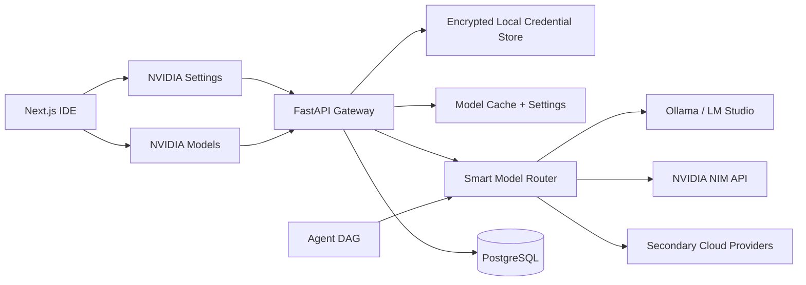
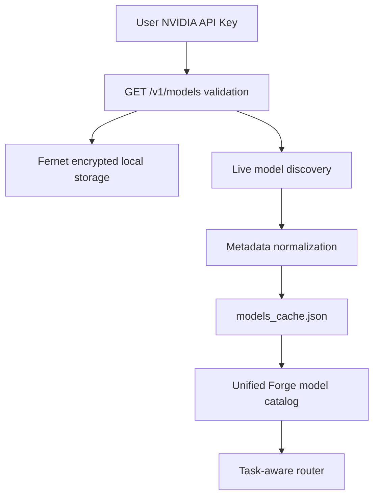
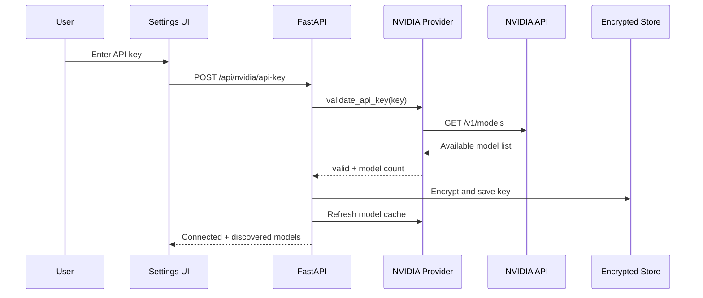
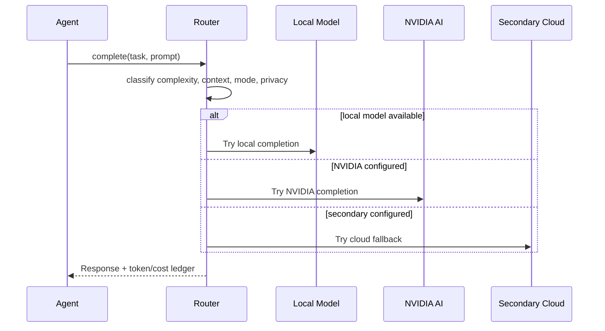

# NVIDIA AI Provider Upgrade

Forge now treats NVIDIA AI as a first-class provider while keeping the existing
Claude, OpenAI-compatible, Ollama, LM Studio, Google, and other provider paths.
The implementation is discovery-first: the IDE asks the signed-in NVIDIA account
which models are available, stores a local cache, and only uses a configurable
JSON fallback catalog when discovery is unavailable.

## Revised System Architecture



## Provider Abstraction

All providers implement the same contract in
`services/orchestrator/orchestrator/models/provider_interface.py`:

| Capability | Contract method |
|---|---|
| List available models | `list_available_models(refresh=False)` |
| Validate API key | `validate_api_key(api_key=None)` |
| Chat completion | `chat_completion(messages, model, options)` |
| Streaming responses | `stream_chat_completion(messages, model, options)` |
| Embeddings | `embeddings(inputs, model)` |
| Tool/function calling | `ChatCompletionOptions.tools` |
| Structured output | `ChatCompletionOptions.response_format` |
| Model information | `model_info(model)` |
| Token counting | `count_tokens(text, model)` |
| Health checks | `health_check()` |

The NVIDIA implementation lives in
`services/orchestrator/orchestrator/models/nvidia.py` and uses the OpenAI-
compatible NVIDIA base URL `https://integrate.api.nvidia.com/v1` by default.

## NVIDIA Provider Architecture



### Model Discovery

Forge does not hardcode a NVIDIA free-model list. It calls `/models` on the
configured NVIDIA-compatible endpoint, normalizes every returned model, and uses
the account-visible response as the source of truth. Each model is enriched with:

- Model name and provider owner.
- Context window and max output tokens when exposed by the API.
- Capabilities, including chat, coding, reasoning, vision, embeddings, tool
  calling, and structured output.
- Parameter size inferred from published model IDs when the API omits it.
- Supported languages and recommended use cases inferred from capabilities.
- Availability, rate-limit metadata, relative latency, quality, and cost.

When live discovery cannot run, Forge reads
`FORGE_STATE_DIR/nvidia/nvidia_model_catalog.json`, then falls back to the
packaged `models/catalogs/nvidia_model_catalog.json`. The packaged file ships
with an empty `models` array so operators can update the fallback catalog
without application code changes.

## API Sequence Diagrams

### API Key Validation And Discovery



### Chat Completion With Failover



## Smart Routing Workflow

Router inputs:

- Task type: autocomplete, docs, code, test, debug, plan, review, security,
  deploy, long-context.
- Task complexity: small, medium, large, critical.
- Repository size, file count, and estimated context tokens.
- User mode: local-only, NVIDIA-only, hybrid, cloud fallback, offline, cheap,
  fast, balanced, accurate, GPU, CPU-only.
- Privacy setting and upload approval requirement.
- Available local models, NVIDIA availability, and secondary cloud providers.
- Latency and cost targets.

Selection order examples:

| Mode | Priority |
|---|---|
| Local-only/offline | Local models only |
| NVIDIA-only | Validated NVIDIA models only |
| Hybrid | Local first, NVIDIA second, secondary cloud third |
| Cloud fallback | Local model, NVIDIA model, user-selected fallback |
| Cloud expert | Strongest configured cloud model |

NVIDIA candidates are ranked by capability overlap, accuracy, context window,
and latency. For example, code tasks prefer coding/chat models, security and
review prefer reasoning/coding models, and long-context tasks prefer large
context and reasoning models.

## User Interface

The dashboard now includes a dedicated NVIDIA AI panel:

- Settings tab: API key, connection status, validation, remove key, default
  model, provider priority, streaming toggle, context limit, upload approval,
  excluded folders, token usage, request history, and diagnostics.
- Models tab: fetch/refresh catalog, search, capability filter, sort by latency,
  quality, context, or name, favorite models, pin default model, run benchmark,
  and compare selected models side-by-side.

The shared model picker also includes discovered NVIDIA models through
`GET /api/models`, so every agent role can use a NVIDIA model override.

## Database Updates

The schema adds provider-aware tables:

- `ai_provider_settings`: provider enablement, defaults, priority, upload
  approval, excluded folders, validation status, and credential reference.
- `ai_model_catalog`: discovered model metadata, capabilities, context, rate
  limits, availability, and raw metadata.
- `ai_model_favorites`: favorite/default model pins per user.
- `ai_provider_request_history`: token usage and request history.
- `provider_model_benchmarks`: latency and throughput benchmark results.

The current starter stores NVIDIA state in encrypted local JSON files for the
desktop/local workflow. Production can mirror the same objects into Postgres.

## Security Architecture

- API keys are never returned to the UI. The status endpoint only returns a
  masked hint such as `abcd...wxyz`.
- Keys are encrypted locally with `cryptography.fernet` and file permissions are
  restricted where the OS allows it.
- `NVIDIA_API_KEY` can still be injected through environment variables for
  container or managed deployments.
- Keys are redacted from errors, request history, logs, and response payloads.
- Local files are never uploaded silently. The setting
  `require_file_upload_approval` defaults to true.
- Excluded folders default to `.git`, `.env`, `node_modules`, build outputs,
  secrets, and credentials folders.
- Router modes enforce privacy boundaries: offline/local-only drops cloud
  providers even when a user-selected cloud model is pinned.

## Performance Architecture

- Streaming responses are supported by the NVIDIA provider through server-sent
  event parsing.
- Model discovery is cached for one hour by default.
- Chat and embedding calls record token usage and request history.
- The provider retries timeout, rate-limit, and transient server errors with
  exponential backoff.
- Timeout handling keeps the router free to fail over to the next provider.
- Background refresh can call `POST /api/nvidia/models/refresh`.
- Benchmarking records throughput and latency for per-account model comparison.

## Error Handling Strategy

| Failure | Behavior |
|---|---|
| Missing API key | Provider remains disabled and models show `no key`. |
| Invalid API key | Key is not saved and settings stay disabled. |
| `/models` unavailable | Cached catalog is used; status becomes `degraded`. |
| Rate limit | Retry with backoff, then router failover. |
| Timeout | Retry, then router failover. |
| Unknown metadata | Display `unknown` while preserving raw metadata. |
| Streaming parse error | Skip malformed chunks and continue. |

## Benchmark Framework

Benchmarks run through `POST /api/nvidia/benchmark`:

1. Send a short deterministic prompt to the selected model.
2. Measure elapsed time and tokens per second.
3. Store the result in local history today and `provider_model_benchmarks` in
   production.
4. Compare results alongside relative latency, quality, context, and use cases.

Recommended benchmark suites:

- 25 autocomplete prompts.
- 25 one-function code generation prompts.
- 25 unit-test prompts.
- 15 bug-fix prompts.
- 10 repo-level planning prompts.
- 10 security-review prompts.

## Testing Strategy

- Unit tests for credential encryption, redaction, model normalization, cache
  fallback, and router ordering.
- Gateway tests for status, key validation failure, settings validation, model
  refresh, favorite/default mutation, benchmark failure handling, and compare.
- Frontend type checks for the NVIDIA control panel and model picker.
- Integration tests with a mocked NVIDIA `/models`, `/chat/completions`, and
  `/embeddings` service.
- Manual smoke test with a real NVIDIA API key in development only.

## Step-By-Step Implementation Roadmap

1. Land provider abstraction and NVIDIA provider adapter.
2. Add encrypted local credential storage and validation endpoints.
3. Implement live model discovery and JSON fallback catalog.
4. Merge discovered NVIDIA models into the unified catalog.
5. Add NVIDIA-only, hybrid, and cloud-fallback routing modes.
6. Build Settings and Models UI tabs.
7. Add persistence tables and production DB mirroring.
8. Add mocked provider integration tests.
9. Add background refresh and long-running benchmark jobs.
10. Add organization policy controls for allow/deny lists and upload approval.

## Production Deployment Guide

Environment variables:

```bash
NVIDIA_API_KEY=...
NVIDIA_BASE_URL=https://integrate.api.nvidia.com/v1
FORGE_STATE_DIR=/var/lib/forge
```

Production checklist:

- Prefer secret-manager injection for `NVIDIA_API_KEY`.
- Mount `FORGE_STATE_DIR` on encrypted disk if using local credential storage.
- Restrict logs so request bodies and authorization headers are never emitted.
- Run migrations for the `ai_provider_*` and `ai_model_catalog` tables.
- Schedule `POST /api/nvidia/models/refresh` as a low-frequency background job.
- Add alerts for repeated validation failures, rate limits, and degraded
  discovery.
- Review excluded folders and upload-approval policy before enabling cloud
  repository context sharing.

## References

- NVIDIA API catalog: https://docs.api.nvidia.com/nim/reference
- NVIDIA Build model discovery page: https://build.nvidia.com/explore/discover
